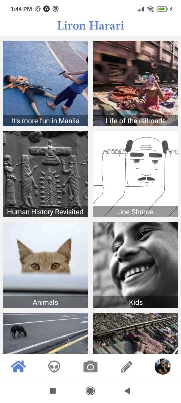
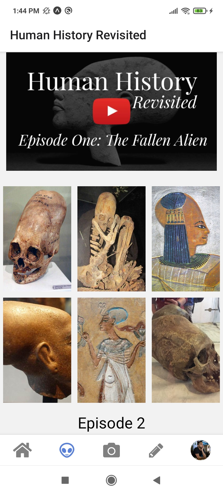
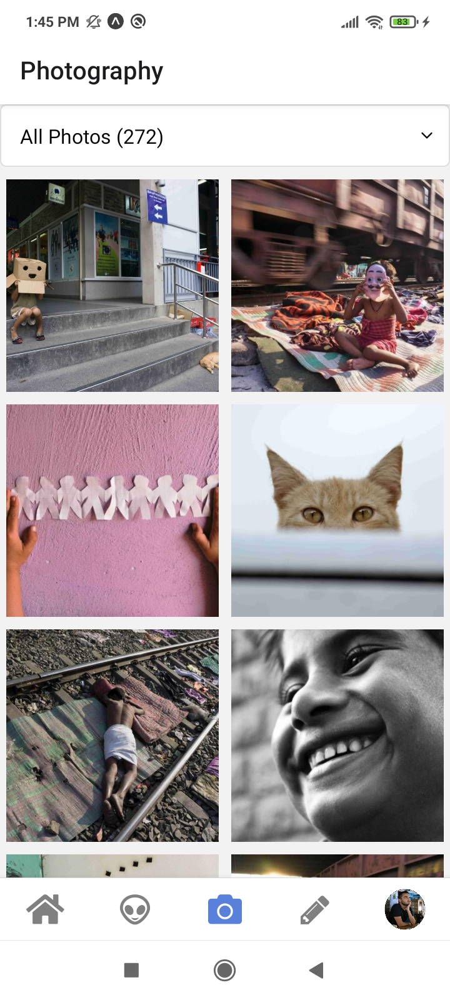
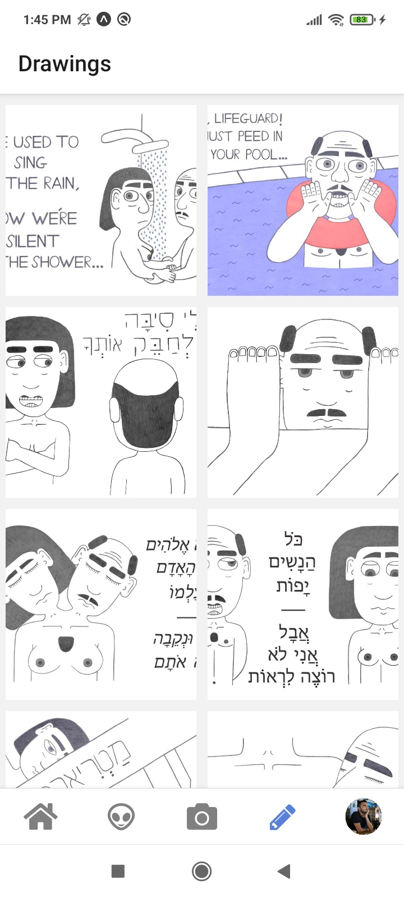
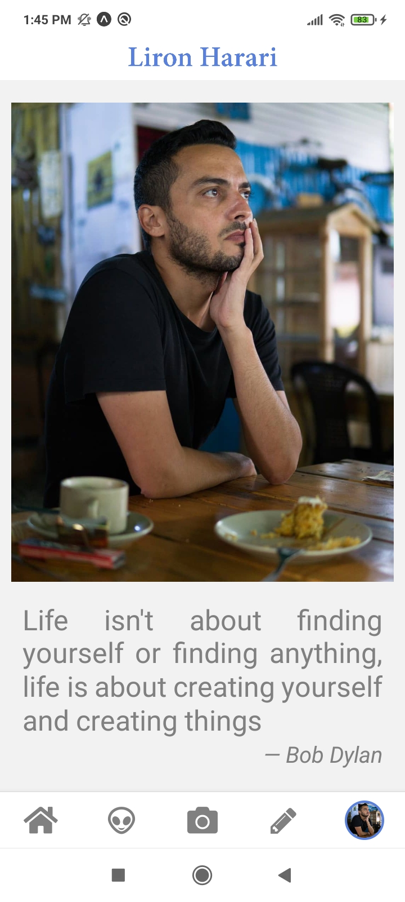

# React Native App using Expo

The app displays artistic projects including:

1) YouTube series - 
[Human History Revisited](https://www.youtube.com/watch?v=zoFTK9Mo0JM&list=PLbd-yCGYHip0TDXxb4NmKelBUQJ-odshp&index=2&t=0s)
2) [Street Photography](https://lironharari.herokuapp.com/street-photography)
3) [Life on the railroads](https://lironharari.herokuapp.com/life-on-the-railroads)
4) [Its more fun in Manila](https://lironharari.herokuapp.com/its-more-fun-in-manila)
5) [Drawings](https://lironharari.herokuapp.com/drawings)

The app was converted from a [Personal Artist Website](https://lironharari.herokuapp.com/)

# Screenshots
### Home screen
;
### Intervention screen
;
### Photography screen
;
### Drawing screen
;
### About screen
;
